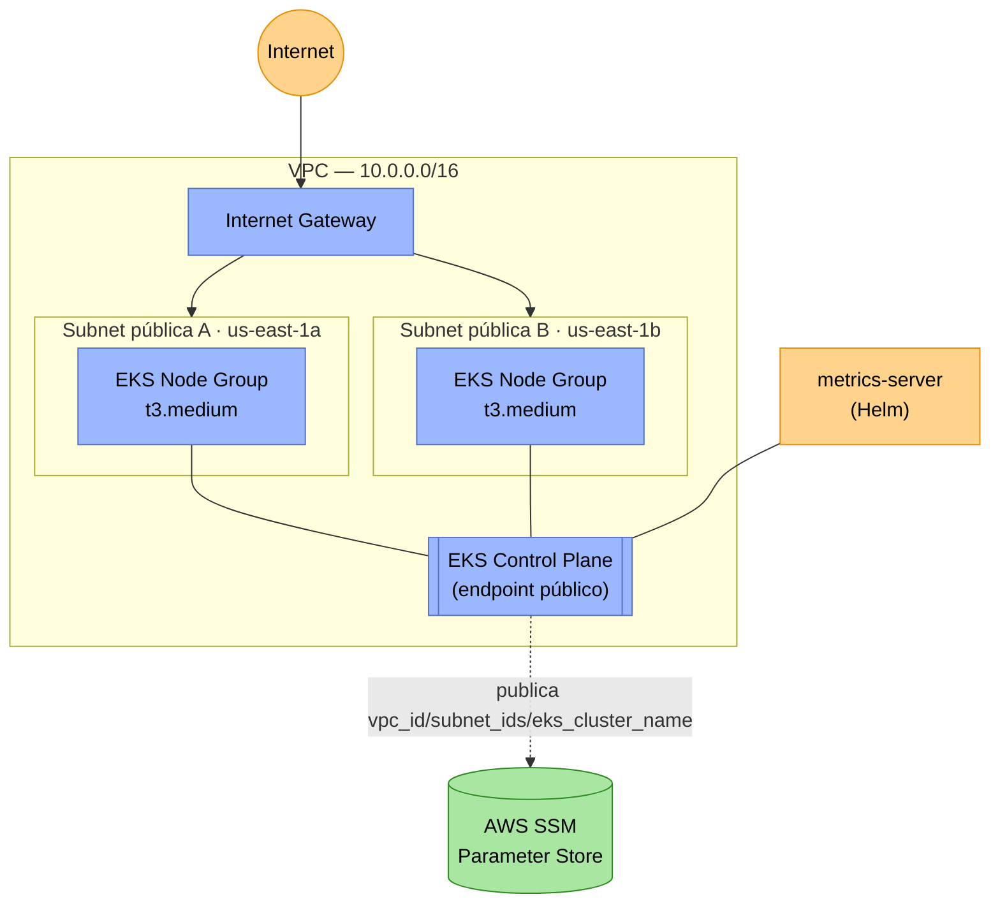

# k8s-infra

Infraestrutura Kubernetes (Terraform) do projeto **Oficina Mecânica** — Fase 3 do Tech Challenge FIAP.

Provisiona a rede e o cluster onde a aplicação principal (repositório [`api`](https://github.com/FIAP-15SOAT-GabrielHelton/api)) é implantada:

- VPC (`10.0.0.0/16`) com 2 subnets públicas (`us-east-1a`/`us-east-1b`), Internet Gateway e route table.
- Cluster EKS (`oficina-mecanica-cluster`) e node group (via `LabRole`, compatível com AWS Academy).
- `metrics-server` (Helm) para habilitar o HPA da aplicação.

Este repositório faz parte de um conjunto de 5 (a arquitetura completa está descrita na [RFC-001](https://github.com/FIAP-15SOAT-GabrielHelton/api/blob/main/docs/fase3/RFC-001-authentication-authorization-serverless.md) do repo `api`):

| Repositório | Responsabilidade |
| :--- | :--- |
| `k8s-infra` (este repo) | VPC + EKS + node group |
| [`db-infra`](https://github.com/FIAP-15SOAT-GabrielHelton/db-infra) | RDS PostgreSQL |
| [`api`](https://github.com/FIAP-15SOAT-GabrielHelton/api) | Aplicação Rails + ECR + deploy no cluster |
| [`auth-serverless`](https://github.com/FIAP-15SOAT-GabrielHelton/auth-serverless) | API Gateway + Lambdas de autenticação/RBAC |
| [`deploy-orchestrator`](https://github.com/FIAP-15SOAT-GabrielHelton/deploy-orchestrator) | Dispara e aguarda o deploy dos 4 repos acima, em ordem |

## Tecnologias utilizadas

| Categoria | Tecnologia |
| :--- | :--- |
| IaC | Terraform (`hashicorp/aws` ~> 5.0, `hashicorp/kubernetes` ~> 2.0, `hashicorp/helm` ~> 2.0) |
| Nuvem | AWS (VPC, EKS, IAM `LabRole` do AWS Academy) |
| Add-on de cluster | `metrics-server` (via provider Helm) |
| CI/CD | GitHub Actions (`workflow_dispatch`) |
| Backend do state | S3 (bucket compartilhado com os demais repositórios, key própria) |

## Arquitetura



- **VPC** (`infra/vpc.tf`): 2 subnets públicas (multi-AZ), Internet Gateway e route table — simplificada de propósito (sem NAT Gateway) para reduzir custo/complexidade no AWS Academy.
- **EKS** (`infra/eks.tf`, `infra/node_group.tf`): cluster gerenciado + node group de 1 a 3 instâncias `t3.medium`, usando a `LabRole` já disponível na conta AWS Academy (não é possível criar IAM roles próprias nesse ambiente).
- **metrics-server** (`infra/metrics_server.tf`): pré-requisito para o HPA da aplicação (`api`) conseguir ler métricas de CPU/memória dos pods.

## Parâmetros publicados (AWS SSM Parameter Store)

Após o `terraform apply`, este repositório publica os seguintes parâmetros para os demais repositórios consumirem:

| Parâmetro | Valor | Consumido por |
| :--- | :--- | :--- |
| `/oficina-mecanica/vpc_id` | ID da VPC | `db-infra` |
| `/oficina-mecanica/subnet_ids` | IDs das subnets públicas, separados por vírgula | `db-infra` |
| `/oficina-mecanica/eks_cluster_name` | Nome do cluster EKS | `api` |

## Execução local

Não há aplicação para "rodar" — apenas o Terraform pode ser validado/planejado localmente (o `apply` real exige uma sessão AWS Academy ativa):

```bash
cd infra/
terraform init -backend=false   # sem backend, só para validar/formatar localmente
terraform validate
terraform fmt -check
```

Para um `plan` completo (exige credenciais AWS válidas e o backend S3 já existir):

```bash
terraform init \
  -backend-config="bucket=<nome-do-bucket-s3>" \
  -backend-config="key=oficina-mecanica/k8s-infra.tfstate" \
  -backend-config="region=us-east-1"

terraform plan
```

## Deploy

Workflow `CD Deploy (VPC & EKS)` (`workflow_dispatch`), recebendo as credenciais temporárias da sessão do AWS Academy (Access Key, Secret Key, Session Token — expiram em ~4h, por isso não ficam salvas como secret).

**Ordem de deploy do projeto**: `k8s-infra` → `db-infra` → `api` → `auth-serverless` (ou use o [`deploy-orchestrator`](https://github.com/FIAP-15SOAT-GabrielHelton/deploy-orchestrator) para disparar tudo de uma vez).

## Destroy

Workflow `CD Destroy (VPC & EKS)`. **Deve rodar por último** (depois de `db-infra` e `api`), pois eles dependem dos parâmetros SSM publicados aqui.

## Documentação da API

Este repositório não expõe nenhuma API HTTP — é infraestrutura pura. A documentação da API do projeto (Swagger/OpenAPI) vive no repositório [`api`](https://github.com/FIAP-15SOAT-GabrielHelton/api#documenta%C3%A7%C3%A3o-da-api).
