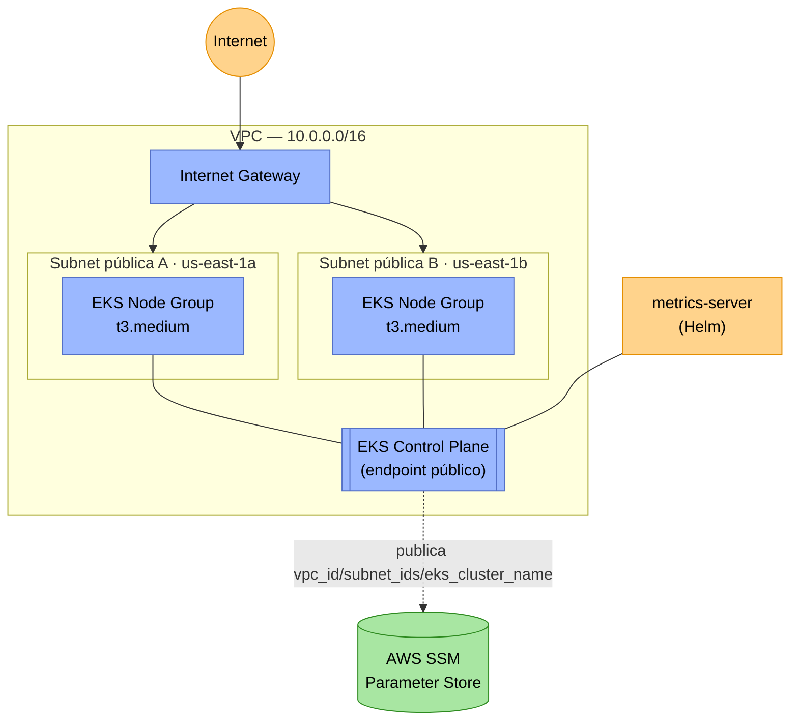

# k8s-infra

Infraestrutura Kubernetes (Terraform) do projeto **Oficina Mecânica** — Fase 3 do Tech Challenge FIAP.

Provisiona a rede e o cluster onde a aplicação principal (repositório [`api`](https://github.com/FIAP-15SOAT-GabrielHelton/api)) é implantada:

- VPC (`10.0.0.0/16`) com 2 subnets públicas (`us-east-1a`/`us-east-1b`), Internet Gateway e route table.
- Cluster EKS (`oficina-mecanica-cluster`) e node group (via `LabRole`, compatível com AWS Academy).
- `metrics-server` (Helm) para habilitar o HPA da aplicação.

Este repositório faz parte de um conjunto de 5 (a arquitetura completa está descrita na [RFC-001](https://github.com/FIAP-15SOAT-GabrielHelton/api/blob/main/docs/fase3/RFC-001-authentication-authorization-serverless.md) do repo `api`):

| Repositório | Responsabilidade |
| :--- | :--- |
| `k8s-infra` (este repo) | VPC + EKS + node group |
| [`db-infra`](https://github.com/FIAP-15SOAT-GabrielHelton/db-infra) | RDS PostgreSQL |
| [`api`](https://github.com/FIAP-15SOAT-GabrielHelton/api) | Aplicação Rails + ECR + deploy no cluster |
| [`auth-serverless`](https://github.com/FIAP-15SOAT-GabrielHelton/auth-serverless) | API Gateway + Lambdas de autenticação/RBAC |
| [`deploy-orchestrator`](https://github.com/FIAP-15SOAT-GabrielHelton/deploy-orchestrator) | Dispara e aguarda o deploy dos 4 repos acima, em ordem |

## Tecnologias utilizadas

| Categoria | Tecnologia |
| :--- | :--- |
| IaC | Terraform (`hashicorp/aws` ~> 5.0, `hashicorp/kubernetes` ~> 2.0, `hashicorp/helm` ~> 2.0) |
| Nuvem | AWS (VPC, EKS, IAM `LabRole` do AWS Academy) |
| Add-on de cluster | `metrics-server` (via provider Helm) |
| CI/CD | GitHub Actions (`pull_request` para validação, `workflow_dispatch` para deploy/destroy) |
| Backend do state | S3 (bucket compartilhado com os demais repositórios, key própria) |

## Arquitetura


```mermaid
flowchart TB
    Internet((Internet))

    subgraph VPC["VPC — 10.0.0.0/16"]
        IGW["Internet Gateway"]

        subgraph SubA["Subnet pública A · us-east-1a"]
            NodeA["EKS Node Group\nt3.medium"]
        end

        subgraph SubB["Subnet pública B · us-east-1b"]
            NodeB["EKS Node Group\nt3.medium"]
        end

        EKS[["EKS Control Plane\n(endpoint público)"]]
    end

    MS["metrics-server\n(Helm)"]
    SSM[("AWS SSM\nParameter Store")]

    Internet --> IGW --> SubA
    IGW --> SubB
    NodeA --- EKS
    NodeB --- EKS
    MS --- EKS
    EKS -. publica vpc_id/subnet_ids/eks_cluster_name .-> SSM

    classDef net fill:#9bb8ff,stroke:#5470c6,color:#000
    classDef ext fill:#ffd38c,stroke:#e58e00,color:#000
    classDef db fill:#a8e6a2,stroke:#2d8a1f,color:#000

    class IGW,NodeA,NodeB,EKS net
    class MS,Internet ext
    class SSM db
```

- **VPC** (`infra/vpc.tf`): 2 subnets públicas (multi-AZ), Internet Gateway e route table — simplificada de propósito (sem NAT Gateway) para reduzir custo/complexidade no AWS Academy.
- **EKS** (`infra/eks.tf`, `infra/node_group.tf`): cluster gerenciado + node group de 1 a 3 instâncias `t3.medium`, usando a `LabRole` já disponível na conta AWS Academy (não é possível criar IAM roles próprias nesse ambiente).
- **metrics-server** (`infra/metrics_server.tf`): pré-requisito para o HPA da aplicação (`api`) conseguir ler métricas de CPU/memória dos pods.

## Parâmetros publicados (AWS SSM Parameter Store)

Após o `terraform apply`, este repositório publica os seguintes parâmetros para os demais repositórios consumirem:

| Parâmetro | Valor | Consumido por |
| :--- | :--- | :--- |
| `/oficina-mecanica/vpc_id` | ID da VPC | `db-infra` |
| `/oficina-mecanica/subnet_ids` | IDs das subnets públicas, separados por vírgula | `db-infra` |
| `/oficina-mecanica/eks_cluster_name` | Nome do cluster EKS | `api` |

## Execução local

Não há aplicação para "rodar" — apenas o Terraform pode ser validado/planejado localmente (o `apply` real exige uma sessão AWS Academy ativa):

```bash
cd infra/
terraform init -backend=false   # sem backend, só para validar/formatar localmente
terraform validate
terraform fmt -check
```

Para um `plan` completo (exige credenciais AWS válidas e o backend S3 já existir):

```bash
terraform init \
  -backend-config="bucket=<nome-do-bucket-s3>" \
  -backend-config="key=oficina-mecanica/k8s-infra.tfstate" \
  -backend-config="region=us-east-1"

terraform plan
```

## CI

Workflow `CI (Terraform Validate)` (`.github/workflows/ci.yml`), disparado em toda Pull Request contra `main` que toque em `infra/**` — é o status check exigido pela proteção da branch `main` antes do merge. Como não há credenciais AWS disponíveis automaticamente em PR (só existem via input manual no `workflow_dispatch` de deploy), a validação é limitada ao que não depende de nuvem real:

1. **Terraform Format Check** (`terraform fmt -check -recursive`) — garante que todo `.tf` está formatado no padrão canônico.
2. **Terraform Init sem backend** (`terraform init -backend=false`) — baixa os providers só para permitir a validação sintática, sem tentar acessar o bucket S3 remoto.
3. **Terraform Validate** (`terraform validate`) — valida sintaxe, tipos e referências internas do código (detecta, por exemplo, o erro de `resource "newrelic_dashboard"` vs. o nome correto `newrelic_one_dashboard` antes mesmo de chegar num `apply`).

Não roda `terraform plan` nesta etapa — um plan real exigiria as credenciais efêmeras da sessão AWS Academy, que só chegam no momento do deploy manual.

## Deploy

Workflow `CD Deploy (VPC & EKS)` (`.github/workflows/cd_deploy.yml`, `workflow_dispatch`), disparado manualmente informando as credenciais temporárias da sessão do AWS Academy (Access Key, Secret Key, Session Token — expiram em ~4h, por isso não ficam salvas como secret fixo). Passos do job `deploy`:

1. **Mask Sensitive Credentials** — mascara as credenciais AWS e as chaves do New Relic no log do Actions (`::add-mask::`).
2. **Configure AWS Credentials** — autentica a sessão via `aws-actions/configure-aws-credentials`.
3. **Bootstrap S3 Backend** — cria (se ainda não existir) o bucket S3 compartilhado de state do Terraform entre os 4 repositórios (`oficina-mecanica-tfstate-<account-id>`), resolvendo o problema de o `terraform init` precisar de um backend que ainda não existe na primeira execução.
4. **Terraform Provisioning** — `terraform init` (contra o backend recém-garantido) + `terraform apply -auto-approve`, provisionando VPC, cluster EKS, node group (com autoscaling), `metrics-server`, a integração New Relic Kubernetes e o dashboard/alertas do New Relic, publicando `vpc_id`/`subnet_ids`/`eks_cluster_name` no SSM Parameter Store para `db-infra` e `api` consumirem.

**Ordem de deploy do projeto**: `k8s-infra` → `db-infra` → `api` → `auth-serverless` (ou use o [`deploy-orchestrator`](https://github.com/FIAP-15SOAT-GabrielHelton/deploy-orchestrator) para disparar tudo de uma vez).

## Observabilidade

Este repositório provisiona a camada de monitoramento de infraestrutura e o controle central do New Relic:

- **New Relic Infrastructure** (`nri-kubernetes`, Helm chart `newrelic/nri-bundle`) — coleta CPU/memória do cluster EKS (nodes e pods).
- **Dashboard e policy de alertas** (provider Terraform `newrelic`) — dashboard com volume diário de OS, tempo médio de execução por etapa e erros/falhas de integração; alertas por e-mail para latência elevada, falhas no processamento de OS/orçamentos e indisponibilidade do healthcheck. Consulta dados enviados por `api` e `auth-serverless`, mas fica centralizado aqui por ser a infraestrutura observacional do projeto.

Secrets/variáveis do repositório: `NEW_RELIC_LICENSE_KEY`, `NEW_RELIC_ACCOUNT_ID`, `NEW_RELIC_API_KEY` (secrets) e `NEW_RELIC_REGION`, `NEW_RELIC_ALERT_EMAIL` (variables, não sensíveis).

Detalhes de arquitetura: [`docs/fase3/architecture/component-diagram.md`](https://github.com/FIAP-15SOAT-GabrielHelton/api/blob/main/docs/fase3/architecture/component-diagram.md#4-monitoramento) e [ADR 11](https://github.com/FIAP-15SOAT-GabrielHelton/api/blob/main/docs/fase3/architecture/adr-log.md#adr-11-new-relic-como-ferramenta-de-observabilidade-e-monitoramento) (repositório `api`).

## Destroy

Workflow `CD Destroy (VPC & EKS)`. **Deve rodar por último** (depois de `db-infra` e `api`), pois eles dependem dos parâmetros SSM publicados aqui.

## Documentação da API

Este repositório não expõe nenhuma API HTTP — é infraestrutura pura. A documentação da API do projeto (Swagger/OpenAPI) vive no repositório [`api`](https://github.com/FIAP-15SOAT-GabrielHelton/api#documenta%C3%A7%C3%A3o-da-api).
